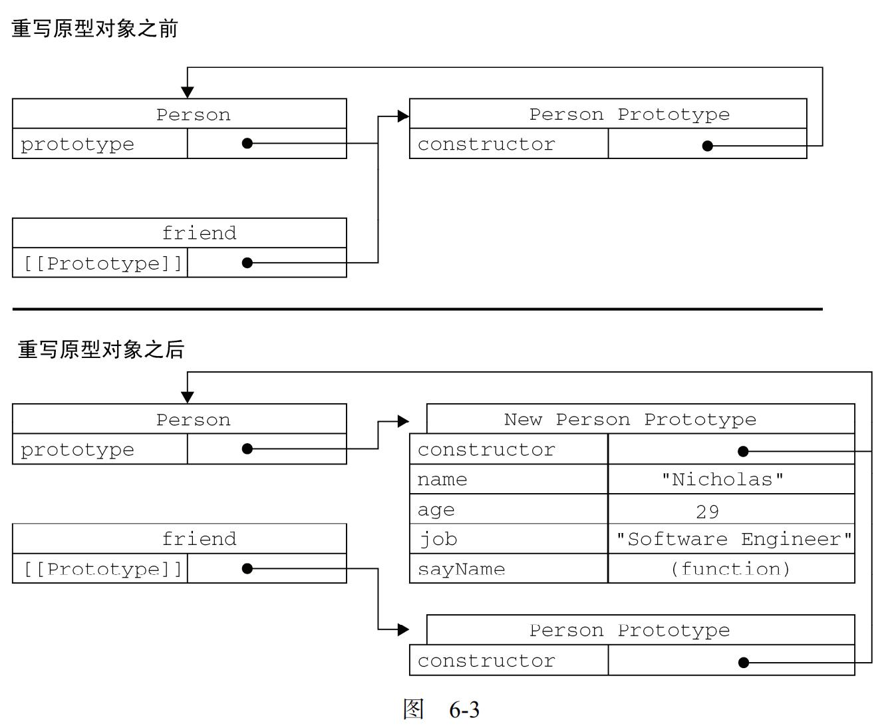
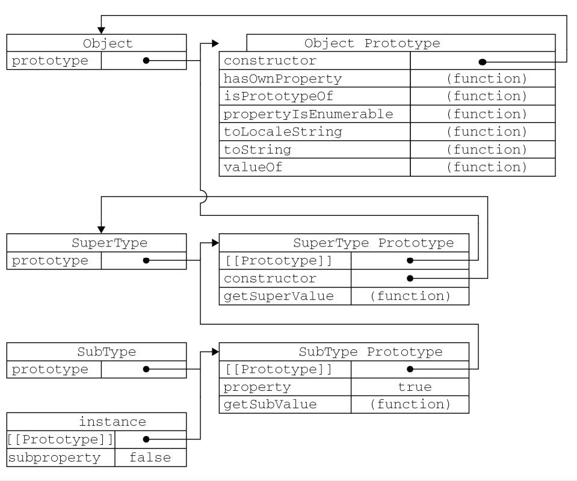
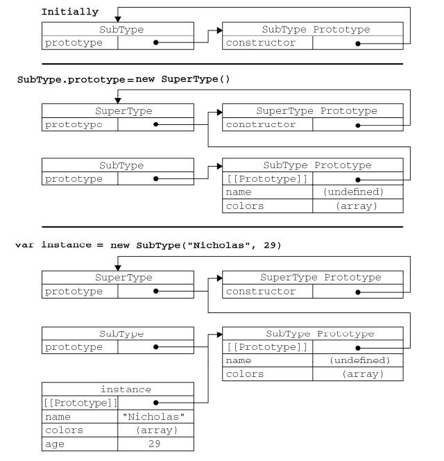
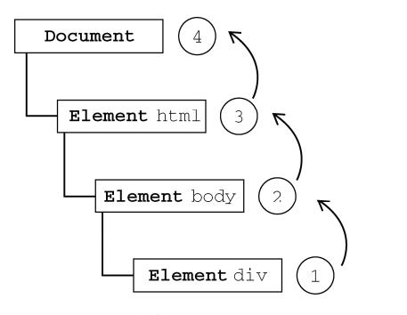
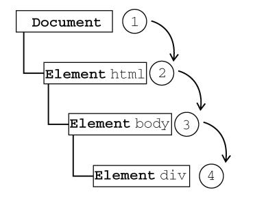
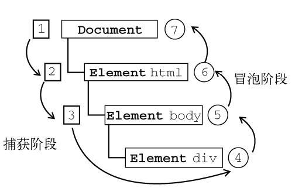
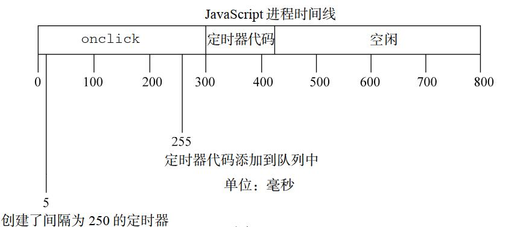

[TOC]

# 类型值分类

## 基本类型值

简单数据段，操作的是实际的值

## 引用类型值

那些可能由多个值构成的对象，操作的是对象的引用

# 垃圾回收机制

## 标记清除

给内存中的所有变量加上标记，去掉环境中的变量以及被环境中引用的变量，剩下被标记的将会被清除

## 引用计数

值被引用 1 次加 1 相反-1，当变成 0 时则说明没有办法在访问这个值，就将在下次垃圾收集器运行时将其内存空间回收

- 缺点

出现代码循环引用次数永远为 0，如果在重复调用函数，导致大量内存不会被回收，ie9 以前其 bom dom 使用 C++ COM 对象的形式实现的，没有转换成 js 对象.  
COM 采用引用计数策略导致不能回收重复引用，办法，在不使用时手动将 obj.foo=null 解除引用，就避免了内存泄露现象

### 循环引用实例

```js
var element = document.getElementById("some_element");
var myObject = new Object();
myObject.element = element;
element.someObject = myObject;

myObject.element = null;
element.someObject = null;
```

# 基本包装类

## 特殊引用类型

String，Number，Boolean

### 访问过程

1.创建 string 类型的一个实例  
2.在实例上调用指定的方法  
3.销毁这个实例

#### js 伪代码表示

```js
var s1 = new String("some text");
var s2 = s1.substring(2);
s1 = null;
```

#### 为什么我们不能给字符串添加属性

列如像这样：

```js
var s1 = "some text";
s1.color = "red";
alert(s1.color);
```

- 在第二步创建 string 对象在执行第三行代码时已经被销毁了,所以我们不能在访问到了

# call，apply，bind 区别

## call

- 第一个参数作用域，第二个参数接受函数参数必须一个个枚举出来

## apply

- 第一个参数作用域，第二个参数可传 arguments，数组

## bind

- 会创建一个函数实例

# 对象

## 数据属性

数据属性包含一个数据值的位置。在这个位置可以读取和写入值

```js
let obj = {
  configurable: true,
  enumerable: true,
  writable: true,
  value: true,
};
```

## 访问器属性

不包含数据值

```js
let obj = {
  configurable: true,
  enumerable: true,
  get: function () {},
  set: function () {},
};
```

# 设计模式

## 工厂模式

```js
function createPerson(name, age, job) {
  var o = new Object();
  o.name = name;
  o.age = age;
  o.job = job;
  o.sayName = function () {
    alert(this.name);
  };
  return o;
}
var person1 = createPerson("Nicholas", 29, "Software Engineer");
var person2 = createPerson("Greg", 27, "Doctor");
```

### 缺点

工厂模式解决了创建多个对象的问题，但是没有解决对象的识别问题（怎样知道一个对象的类型）

## 构造函数模式

```js
function Person(name, age, job) {
  this.name = name;
  this.age = age;
  this.job = job;
  this.sayName = function () {
    alert(this.name);
  };
}
var person1 = new Person("Nicholas", 29, "Software Engineer");
var person2 = new Person("Greg", 27, "Doctor");
```

### 构造函数与工厂模式区别

1.没有显示的创建对象  
2.直接将属性和方法赋给了 this 对象  
3.没有 return 语句

### 创建过程

对象名字开头大写，必须使用 new 关键字创建，经历步骤如下四步。

1.创建一个新对象  
2.将构造函数的作用域赋值给新对象（因此 this 就指向了这个新对象）  
3.执行构造函数中的代码(为这个新对象添加属性)  
4.返回新对象

### 缺点

使用构造函数的主要问题，就是每个方法都要在每个
实例上重新创建一遍

### 解决构造函数多次创建问题分析

```js
function Person(name, age, job) {
  this.name = name;
  this.age = age;
  this.job = job;
  this.sayName = sayName;
}
function sayName() {
  alert(this.name);
}
var person1 = new Person("Nicholas", 29, "Software Engineer");
var person2 = new Person("Greg", 27, "Doctor");
```

解决构造函数相同功能方法创建多次的问题，把函数放到全局作用域，但是这样会在全局作用域
创建只能被某个对象调用，让全局有点名不副实，过多的定义了全局函数，自定义的引用类型失去了封装的意义，这些问题可以原型模式来解决

## 原型模式

```js
function Person() {}
Person.prototype.name = "Nicholas";
Person.prototype.age = 29;
Person.prototype.job = "Software Engineer";
Person.prototype.sayName = function () {
  alert(this.name);
};
var person1 = new Person();
person1.sayName(); //"Nicholas"
var person2 = new Person();

person2.sayName(); //"Nicholas"
alert(person1.sayName == person2.sayName); //true
```

构造函数变成了空函数，新创建的对象会有相同的属性和方法，与构造函数不同的是所有实例都共享
这些属性和方法

### **proto**

连接在实例与构造函数的原型对象之间，而不是存在于实例与构造函数之间

### constructor

所有的原型对象都会自动获取一个 constructor（构造函数）属性，这个属性包含一个指向 prototype 属性所在函数的指针

### getPrototypeOf

用于获取实列中的 prototype

```js
Object.getPrototypeOf(person1);
```

### isPrototypeOf

判断实例是否来自某一个原型对象

```js
Person.prototype.isPrototypeOf(person1);
```

### 原型链

#### 原型链查找步骤

每当代码读取某个对象属性时，都会执行一次搜索，首先从对象实例本身开始，如果找到了给定名字属性就返回，如果没有  
则继续搜索指针指向的原型对象中查找，找到了就返回，没找到返回 undefined

#### 原型屏蔽

```js
Person.prototype.name = "Nicholas";
person1.name = "Greg";
alert(person1.name); //"Greg"——来自实例
alert(person2.name); //"Nicholas"——来自原型
```
这里person1.name不是重写原型对象，而是对原型对象的 name 属性进行了屏蔽，即使设置为 null 也只是设置实例的这个属性
如果想要访问原型中的name='Nicholas'值,可以使用delete来删除对象中的属性
#### object.hasOwnProperty('key')

来判断实例的属性访问的是原型上的还是实例上的属性

```js
person2.hasOwnProperty("name");
```

#### 'key' in object

```js
‘name’ in person1
```

用于判断属性是否在原型或者实例上，任意一个在就返回 true，需结合 hasOwnProperty
判断属性是否在原型上还是实例中

#### Object.keys()

```js
var keys = Object.keys(Person.prototype);
alert(keys); //【"name,age,job,sayName"】
```

返回一个包含所有可枚举的字符串数组

```js
var keys = Object.getOwnPropertyNames(Person.prototype);
alert(keys); //"constructor,name,age,job,sayName"
```

得到所有实例属性，无论他是否可枚举

#### 简单的原型语法

```js
function Person() {}
Person.prototype = {
  name: "Nicholas",
  age: 29,
  job: "Software Engineer",
  sayName: function () {
    alert(this.name);
  },
};
```

通过对象字面量的方式重写了原型对象，以上代码本质上是完全重写了 propotype 对象，因此 constructor 属性就变成了  
新对象的 constructor 属性（指向 Object 构造函数），不在指向 person 函数，尽管 instanceof
操作符还能返回正确的结果，但通过 constructor 已经无法确定对象的类型了

```js
var friend = new Person();
alert(friend instanceof Object); //true
alert(friend instanceof Person); //true
alert(friend.constructor == Person); //false
alert(friend.constructor == Object); //true
```

但 constructor 属性则，等于 Object 而不等于 Person 了  
可以向以下代码设置会原始的 constructor 的值

```js
function Person() {}
Person.prototype = {
  constructor: Person,
  name: "Nicholas",
  age: 29,
  job: "Software Engineer",
  sayName: function () {
    alert(this.name);
  },
};
```

以上方式重新设置了 constructor 的属性会导致 enumerable 特性被设置成 true，默认情况 constructor 属性是不可枚举的。

因此可用 _Object.defineProperty()_ 设置回去

```js
//重设构造函数，只适用于 ECMAScript 5 兼容的浏览器
Object.defineProperty(Person.prototype, "constructor", {
  enumerable: false,
  value: Person,
});
```

#### 原型的动态性

- 重新原型之前

```js
var friend = new Person();
Person.prototype.sayHi = function () {
  alert("hi");
};
friend.sayHi(); //"hi"（没有问题！）
```

- 重写圆形之后

```js
function Person() {}
var friend = new Person();
Person.prototype = {
  constructor: Person,
  name: "Nicholas",
  age: 29,
  job: "Software Engineer",
  sayName: function () {
    alert(this.name);
  },
};
friend.sayName(); //error
```


重写的原型对象切断了现有原型与任何之前已经存在的对象实例之前的联系，他引用的任然是
最初的原型  
避免在原型上自定义方法，这样可能会意外的重写原生方法

#### 原型对象存在的问题

原型模式缺少了构造函数传参初始化的环节，默认实例中都是取相同的属性值，毕竟可以在
实例上添加一个同名属性隐藏原型中对应的属性

更严重的问题对于包含引用值的属性来讲

```js
function Person() {}
Person.prototype = {
  constructor: Person,
  name: "Nicholas",
  age: 29,
  job: "Software Engineer",
  friends: ["Shelby", "Court"],
  sayName: function () {
    alert(this.name);
  },
};
var person1 = new Person();
var person2 = new Person();
person1.friends.push("Van");
alert(person1.friends); //"Shelby,Court,Van"
alert(person2.friends); //"Shelby,Court,Van"
alert(person1.friends === person2.friends); //true
```

改变实例 person1 中的 friends 字符串数组时，实际上是改变了 Person 原型对象中的字符串数组  
组合使用构造函数模式和原型模式 （最广泛，认同度最高的一种创建自定义类型的方法）  
使用构造函数模式用于定义实例属性（可动态传入初始值），使用原型模式定义方法和共享的属性，
这样每个实例都有自己的一份实例属性副本，又共享着对原型方法的引用

```js
function Person(name, age, job) {
  this.name = name;
  this.age = age;
  this.job = job;
  this.friends = ["Shelby", "Court"];
}
Person.prototype = {
  constructor: Person,
  sayName: function () {
    alert(this.name);
  },
};
var person1 = new Person("Nicholas", 29, "Software Engineer");
var person2 = new Person("Greg", 27, "Doctor");
person1.friends.push("Van");
alert(person1.friends); //"Shelby,Count,Van"
alert(person2.friends); //"Shelby,Count"
alert(person1.friends === person2.friends); //false
alert(person1.sayName === person2.sayName); //true
```

## 动态原型模式

解决有其他 oo 开发经验的人员看到独立的构造函数和原型时比较困惑的问题

```js
function Person(name, age, job) {
  //属性
  this.name = name;
  this.age = age;
  this.job = job;
  计;
  //方法
  if (typeof this.sayName != "function") {
    Person.prototype.sayName = function () {
      alert(this.name);
    };
  }
}
var friend = new Person("Nicholas", 29, "Software Engineer");
friend.sayName();
```

### 优点

这里只有在 sayName()方法不存在的情况下才会添加到原型上，只有初次调用构造函数才会被执行
在对原型上的修改都会立即在所有实例中得到反映

### 缺点

不能使用对象字面量去重写原型这样会导致切断现有原型与新原型之间的联系

## 寄生构造函数模式

```js
function Person(name, age, job) {
  var o = new Object();
  o.name = name;
  o.age = age;
  o.job = job;
  o.sayName = function () {
    alert(this.name);
  };
  return o;
}
var friend = new Person("Nicholas", 29, "Software Engineer");
friend.sayName(); //"Nicholas"
```

跟工厂模式其实是一模一样的
这个模式可以在特殊情况下用来为对象创建构造函数

比如我们不建议在直接修改 Array 构造函数，但是我们可以用一下方式去完成

```js
function SpecialArray() {
  //创建数组
  var values = new Array();
  //添加值
  values.push.apply(values, arguments);
  //添加方法
  values.toPipedString = function () {
    return this.join("|");
  };
  //返回数组
  return values;
}
var colors = new SpecialArray("red", "blue", "green");
alert(colors.toPipedString()); //"red|blue|green"
```

返回的构造函数与 Array 构造函数的原型属性之间没有关系  
不能依赖 instanceof 操作符来确定对象的类型，建议有其他模式的情况下不使用该模式

## 稳妥构造函数模式

稳妥对象 指没有公共属性，而且其方法也不引用 this 的对象  
适合在一些安全环境中，或者防止数据被其他应用所修改

### 特点

新创建的实例对象方法不引用 this  
不使用 new 操作符调用构造函数

```js
function Person(name, age, job) {
  //创建要返回的对象
  var o = new Object();
  //可以在这里定义私有变量和函数
  //添加方法
  o.sayName = function () {
    alert(name);
  };
  //返回对象
  return o;
}
var friend = Person("Nicholas", 29, "Software Engineer");
friend.sayName(); //"Nicholas"
```

只能通过调用实例的 sayName 方法来访问实例数据  
这种模式创建的对象与构造函数之间也没有什么联系，因此 instanceof 操作对这种对象也没有什么意义

# 继承

许多 oo 语言都支持两种集成方式：接口集成和实现集成  
接口继承只继承方法签名，实现继承则继承的方法  
由于函数式没有签名的在 ECMAScript 中无法实现接口继承  
主要继承实现依赖原型链

## 扩充知识点

函数签名包括：  
1.参数及参数类型  
2.一个的返回值及其类型  
3.可能会抛出和传回的异常  
4.该方法在面向对象程序中的可用性方面的信息（如 public，static,prototype）  

### 参考
- [函数签名](https://developer.mozilla.org/zh-CN/docs/Glossary/Signature/Function)

## 原型链继承

利用原型让一个引用类型集成另一个引用类型的属性和方法

```js
function SuperType() {
  this.property = true;
}
SuperType.prototype.getSuperValue = function () {
  return this.property;
};
function SubType() {
  this.subproperty = false;
}
//继承了 SuperType
SubType.prototype = new SuperType();
SubType.prototype.getSubValue = function () {
  return this.subproperty;
};
var instance = new SubType();
alert(instance.getSuperValue()); //true
```

通过将 subType.prototype 指向 SuperType 的实例实现继承，subType.prototype 中不仅有所有的
superType 的属性和方法，还有指向 superType 原型的指针

以上实例代码查找过程  
1.搜索实例；  
2.搜索 SubType.prototype；  
3.搜索 SuperType.prototype，  
我们知道在访问一个实例属性时会从自身开始查找，没找到再去搜索实例的原型在通过原型链  
实现继承的情况下，搜索沿着原型链继续向上，搜索过程总是要一环一环的前行到原型链末端才会停止



## 确定原型和实例的关系

```js
alert(instance instanceof Object); //true
alert(instance instanceof SuperType); //true
alert(instance instanceof SubType); //true
```

都可以说 instance 是 Object，SuperType，SubType 的实例

```js
alert(Object.prototype.isPrototypeOf(instance)); //true
alert(SuperType.prototype.isPrototypeOf(instance)); //true
alert(SubType.prototype.isPrototypeOf(instance)); //true
```

只要在原型链中出现过的原型都可以说是该原型链所派生的实例原型

## 构造函数继承

```js
function SuperType(name) {
  this.name = name;
}
function SubType() {
  //继承了 SuperType，同时还传递了参数
  SuperType.call(this, "Nicholas");
  //实例属性
  this.age = 29;
}
var instance = new SubType();
alert(instance.name); //"Nicholas";
alert(instance.age); //29
```

满足了传递参数初始化，通过 call 调用，解决了实例修改属性该实例上没有的属性或方法
其他实例也被修改的问题

缺点  
方法都在构造函数中无法被复用，超类中定义的方法对于子类也是不可见的，所有类型都只能使用
构造函数模式，他有的问题都存在，很少单独使用

## 组合继承

```js
function SuperType(name) {
  this.name = name;
  this.colors = ["red", "blue", "green"];
}
SuperType.prototype.sayName = function () {
  alert(this.name);
};
function SubType(name, age) {
  //继承属性
  SuperType.call(this, name);
  this.age = age;
}
//继承方法
SubType.prototype = new SuperType();
SubType.prototype.constructor = SubType;
SubType.prototype.sayAge = function () {
  alert(this.age);
};
var instance1 = new SubType("Nicholas", 29);
instance1.colors.push("black");
alert(instance1.colors); //"red,blue,green,black"
instance1.sayName(); //"Nicholas";
instance1.sayAge(); //29
var instance2 = new SubType("Greg", 27);
alert(instance2.colors); //"red,blue,green"
instance2.sayName(); //"Greg";
instance2.sayAge(); //27
```

避免了选型链和构造函数的劣势，常用的继承模式，而且使用
instanceof 和 isPrototypeOf()识别继承创建的对象

## 原型式继承

```js
function object(o) {
  function F() {}
  F.prototype = o;
  return new F();
}
```

创建一个临时性的构造函数，然后传入对象作为构造函数的原型，在返回一个新实例,
这个是对对象进行的浅复制，每一个实例都创建了一个副本  
ECMAScript5 新增了 Object.create()方法规范化了原型继承
[Object.create()](https://developer.mozilla.org/zh-CN/docs/Web/JavaScript/Reference/Global_Objects/Object/create)

## 寄生式继承

思路与寄生构造函数和工厂模式类似，即创建一个仅用于封装继承过程的函数
该函数内部以某种方式来增强对象

```js
function createAnother(original) {
  var clone = object(original); //通过调用函数创建一个新对象
  clone.sayHi = function () {
    //以某种方式来增强这个对象
    alert("hi");
  };
  return clone; //返回这个对象
}
```

```js
var person = {
  name: "Nicholas",
  friends: ["Shelby", "Court", "Van"],
};
var anotherPerson = createAnother(person);
anotherPerson.sayHi(); //"hi"
```

使用该模式添加函数，函数无法复用，这点与构造函数模式类似

## 寄生组合模式继承

组合继承会调用两次超类构造函数

```js
function SuperType(name) {
  this.name = name;
  this.colors = ["red", "blue", "green"];
}
SuperType.prototype.sayName = function () {
  alert(this.name);
};
function SubType(name, age) {
  SuperType.call(this, name); //第二次调用 SuperType()
  this.age = age;
}
SubType.prototype = new SuperType(); //第一次调用 SuperType()
SubType.prototype.constructor = SubType;
SubType.prototype.sayAge = function () {
  alert(this.age);
};
```

寄生组合模式继承，即通过借用构造函数来继承属性，通过原型链的混成形式来继承方法
我们只是需要超类的原型一个副本而已

```js
function inheritPrototype(subType, superType) {
  var prototype = object(superType.prototype); //创建对象
  prototype.constructor = subType; //增强对象
  subType.prototype = prototype; //指定对象
}
```

```js
function SuperType(name) {
  this.name = name;
  this.colors = ["red", "blue", "green"];
}
SuperType.prototype.sayName = function () {
  alert(this.name);
};
function SubType(name, age) {
  SuperType.call(this, name);
  this.age = age;
}
inheritPrototype(SubType, SuperType);
SubType.prototype.sayAge = function () {
  alert(this.age);
};
```



只调用一次超类构造函数，并避免了 SubType.prototype 上面创建不必要的多余的属性，
原型链还能保持不变

# 函数表达式

## 特征

函数声明提升 执行代码之前会先读取函数声明，这意味着可以在函数声明前就调用它

```js
sayHi();
function sayHi() {
  alert("Hi!");
}
```

## 匿名函数

```js
sayHi(); //错误：函数还不存在
var sayHi = function () {
  alert("Hi!");
};
```

因为函数是匿名函数，不能读取到函数声明

## 闭包

指有权访问另一个函数作用域中的变量的函数

```js
var name = "The Window";
var object = {
  name: "My Object",
  getNameFunc: function () {
    return function () {
      return this.name;
    };
  },
};
alert(object.getNameFunc()()); //"The Window"（在非严格模式下)
```

在闭包的内部只会搜索到其活动对象为止，不会访问到外部中的变量

## 模仿块级作用域

```js
function outputNumbers(count) {
  for (var i = 0; i < count; i++) {
    alert(i);
  }
  alert(i); //计数
}
```

在其他语言中，变量 i 只会在 for 循环语句块中有定义，循环一旦结束变量就会被销毁
但在 js 中并不会，在函数内部随处都能访问它

匿名函数创建的局部作用域，减少闭包的内存占用问题，匿名函数没有引用，只要函数执行完毕
就可以立即销毁其作用域链了

```js
(function () {
  var now = new Date();
  if (now.getMonth() == 0 && now.getDate() == 1) {
    alert("Happy new year!");
  }
})();
```

递归函数应始终使用 arguments.callee 来递归地调用自身，不要使用函数名，函数名可能会变化

函数作用域及其所有变量都会在函数执行结束后被销毁

# BOM

## top

对象始终指向最外层窗口实例

## 获取窗口距离屏幕左上角的距离

```js
//Firefox： screenX screenY
//IE、 Safari、 Opera 和 Chrome: screenX screenY
var leftPos =
  typeof window.screenLeft == "number" ? window.screenLeft : window.screenX;
var topPos =
  typeof window.screenTop == "number" ? window.screenTop : window.screenY;
```

该方法获取不到准确的距离屏幕边距的距离
IE，Opera 计算的是可视区域到屏幕左上角的距离
其他浏览器计算是从整个窗口左上角计算到屏幕左上角的距离

## 间歇调用和超时调用

最好不要是用间歇调用，原因一个间歇调用可能会在前一个间歇调用结束之前启动，
而用超时调用来实现

```js
var num = 0;
var max = 10;
function incrementNumber() {
  num++;
  //如果执行次数未达到 max 设定的值，则设置另一次超时调用
  if (num < max) {
    setTimeout(incrementNumber, 500);
  } else {
    alert("Done");
  }
}
setTimeout(incrementNumber, 500);
```

## 解析 url 参数

```js
function getQueryStringArgs() {
  //取得查询字符串并去掉开头的问号
  var qs = location.search.length > 0 ? location.search.substring(1) : "",
    //保存数据的对象
    args = {},
    //取得每一项
    items = qs.length ? qs.split("&") : [],
    item = null,
    name = null,
    value = null,
    //在 for 循环中使用
    i = 0,
    len = items.length;
  //逐个将每一项添加到 args 对象中
  for (i = 0; i < len; i++) {
    item = items[i].split("=");
    name = decodeURIComponent(item[0]);
    value = decodeURIComponent(item[1]);
    if (name.length) {
      args[name] = value;
    }
  }
  return args;
}
var args = getQueryStringArgs();
alert(args["q"]); //"javascript"
alert(args["num"]); //"10"
```

## 客户端检测

### 能力检测

检测浏览器是否具有某些功能函数

```js
var client = (function () {
  //rendering engines
  var engine = {
    ie: 0,
    gecko: 0,
    webkit: 0,
    khtml: 0,
    opera: 0,

    //complete version
    ver: null,
  };

  //browsers
  var browser = {
    //browsers
    ie: 0,
    firefox: 0,
    safari: 0,
    konq: 0,
    opera: 0,
    chrome: 0,

    //specific version
    ver: null,
  };

  //platform/device/OS
  var system = {
    win: false,
    mac: false,
    x11: false,

    //mobile devices
    iphone: false,
    ipod: false,
    ipad: false,
    ios: false,
    android: false,
    nokiaN: false,
    winMobile: false,

    //game systems
    wii: false,
    ps: false,
  };

  //detect rendering engines/browsers
  var ua = navigator.userAgent;
  if (window.opera) {
    engine.ver = browser.ver = window.opera.version();
    engine.opera = browser.opera = parseFloat(engine.ver);
  } else if (/AppleWebKit\/(\S+)/.test(ua)) {
    engine.ver = RegExp["$1"];
    engine.webkit = parseFloat(engine.ver);

    //figure out if it's Chrome or Safari
    if (/Chrome\/(\S+)/.test(ua)) {
      browser.ver = RegExp["$1"];
      browser.chrome = parseFloat(browser.ver);
    } else if (/Version\/(\S+)/.test(ua)) {
      browser.ver = RegExp["$1"];
      browser.safari = parseFloat(browser.ver);
    } else {
      //approximate version
      var safariVersion = 1;
      if (engine.webkit < 100) {
        safariVersion = 1;
      } else if (engine.webkit < 312) {
        safariVersion = 1.2;
      } else if (engine.webkit < 412) {
        safariVersion = 1.3;
      } else {
        safariVersion = 2;
      }

      browser.safari = browser.ver = safariVersion;
    }
  } else if (/KHTML\/(\S+)/.test(ua) || /Konqueror\/([^;]+)/.test(ua)) {
    engine.ver = browser.ver = RegExp["$1"];
    engine.khtml = browser.konq = parseFloat(engine.ver);
  } else if (/rv:([^\)]+)\) Gecko\/\d{8}/.test(ua)) {
    engine.ver = RegExp["$1"];
    engine.gecko = parseFloat(engine.ver);

    //determine if it's Firefox
    if (/Firefox\/(\S+)/.test(ua)) {
      browser.ver = RegExp["$1"];
      browser.firefox = parseFloat(browser.ver);
    }
  } else if (/MSIE ([^;]+)/.test(ua)) {
    engine.ver = browser.ver = RegExp["$1"];
    engine.ie = browser.ie = parseFloat(engine.ver);
  }

  //detect browsers
  browser.ie = engine.ie;
  browser.opera = engine.opera;

  //detect platform
  var p = navigator.platform;
  system.win = p.indexOf("Win") == 0;
  system.mac = p.indexOf("Mac") == 0;
  system.x11 = p == "X11" || p.indexOf("Linux") == 0;

  //detect windows operating systems
  if (system.win) {
    if (/Win(?:dows )?([^do]{2})\s?(\d+\.\d+)?/.test(ua)) {
      if (RegExp["$1"] == "NT") {
        switch (RegExp["$2"]) {
          case "5.0":
            system.win = "2000";
            break;
          case "5.1":
            system.win = "XP";
            break;
          case "6.0":
            system.win = "Vista";
            break;
          case "6.1":
            system.win = "7";
            break;
          default:
            system.win = "NT";
            break;
        }
      } else if (RegExp["$1"] == "9x") {
        system.win = "ME";
      } else {
        system.win = RegExp["$1"];
      }
    }
  }

  //mobile devices
  system.iphone = ua.indexOf("iPhone") > -1;
  system.ipod = ua.indexOf("iPod") > -1;
  system.ipad = ua.indexOf("iPad") > -1;
  system.nokiaN = ua.indexOf("NokiaN") > -1;

  //windows mobile
  if (system.win == "CE") {
    system.winMobile = system.win;
  } else if (system.win == "Ph") {
    if (/Windows Phone OS (\d+.\d+)/.test(ua)) {
      system.win = "Phone";
      system.winMobile = parseFloat(RegExp["$1"]);
    }
  }

  //determine iOS version
  if (system.mac && ua.indexOf("Mobile") > -1) {
    if (/CPU (?:iPhone )?OS (\d+_\d+)/.test(ua)) {
      system.ios = parseFloat(RegExp.$1.replace("_", "."));
    } else {
      system.ios = 2; //can't really detect - so guess
    }
  }

  //determine Android version
  if (/Android (\d+\.\d+)/.test(ua)) {
    system.android = parseFloat(RegExp.$1);
  }

  //gaming systems
  system.wii = ua.indexOf("Wii") > -1;
  system.ps = /playstation/i.test(ua);

  //return it
  return {
    engine: engine,
    browser: browser,
    system: system,
  };
})();
```

```html
<!DOCTYPE html>
<html>
  <head>
    <title>User-agent Detection Example</title>
    <script type="text/javascript" src="client.js"></script>
  </head>

  <body>
    <h2>Rendering Engines</h2>
    <ul>
      <li>
        client.engine.ie =
        <script>
          document.write(client.engine.ie);
        </script>
      </li>
      <li>
        client.engine.webkit =
        <script>
          document.write(client.engine.webkit);
        </script>
      </li>
      <li>
        client.engine.gecko =
        <script>
          document.write(client.engine.gecko);
        </script>
      </li>
      <li>
        client.engine.khtml =
        <script>
          document.write(client.engine.khtml);
        </script>
      </li>
      <li>
        client.engine.opera =
        <script>
          document.write(client.engine.opera);
        </script>
      </li>
      <li>
        client.engine.ver =
        <script>
          document.write(client.engine.ver);
        </script>
      </li>
    </ul>
    <h2>Browsers</h2>
    <ul>
      <li>
        client.browser.ie =
        <script>
          document.write(client.browser.ie);
        </script>
      </li>
      <li>
        client.browser.safari =
        <script>
          document.write(client.browser.safari);
        </script>
      </li>
      <li>
        client.browser.firefox =
        <script>
          document.write(client.browser.firefox);
        </script>
      </li>
      <li>
        client.browser.konq =
        <script>
          document.write(client.browser.konq);
        </script>
      </li>
      <li>
        client.browser.opera =
        <script>
          document.write(client.browser.opera);
        </script>
      </li>
      <li>
        client.browser.chrome =
        <script>
          document.write(client.browser.chrome);
        </script>
      </li>
      <li>
        client.browser.ver =
        <script>
          document.write(client.browser.ver);
        </script>
      </li>
    </ul>

    <h2>System</h2>
    <ul>
      <li>
        client.system.win =
        <script>
          document.write(client.system.win);
        </script>
      </li>
      <li>
        client.system.mac =
        <script>
          document.write(client.system.mac);
        </script>
      </li>
      <li>
        client.system.x11 =
        <script>
          document.write(client.system.x11);
        </script>
      </li>
      <li>
        client.system.iphone =
        <script>
          document.write(client.system.iphone);
        </script>
      </li>
      <li>
        client.system.ipod =
        <script>
          document.write(client.system.ipod);
        </script>
      </li>
      <li>
        client.system.ipad =
        <script>
          document.write(client.system.ipad);
        </script>
      </li>
      <li>
        client.system.ios =
        <script>
          document.write(client.system.ios);
        </script>
      </li>
      <li>
        client.system.android =
        <script>
          document.write(client.system.android);
        </script>
      </li>
      <li>
        client.system.nokiaN =
        <script>
          document.write(client.system.nokiaN);
        </script>
      </li>
      <li>
        client.system.winMobile =
        <script>
          document.write(client.system.winMobile);
        </script>
      </li>
      <li>
        client.system.wii =
        <script>
          document.write(client.system.wii);
        </script>
      </li>
      <li>
        client.system.ps =
        <script>
          document.write(client.system.ps);
        </script>
      </li>
    </ul>
  </body>
</html>
```

### 怪癖检测

检测浏览器实现中存在的 bug

### 用户代理检测

通过检测浏览器中用户代理字符串来实现，通常信息具有渲染引擎，版本号
系统平台等

# DOM

## nodeList

在非 ie 下可以使用 Array.prototype.slice.call(nodes, 0);将其转换为数组
ie 下需要通过枚举来转换

```js
function convertToArray(nodes) {
  var array = null;
  try {
    array = Array.prototype.slice.call(nodes, 0); //针对非 IE 浏览器
  } catch (ex) {
    array = new Array();
    for (var i = 0, len = nodes.length; i < len; i++) {
      array.push(nodes[i]);
    }
  }
  return array;
}
```

## 事件流

ie 采用事件冒泡 ，现代浏览器都支持事件冒泡
事件从具体的元素开始逐级向上传播到较为不具体的节点



Netscape 事件捕获 事件沿 DOM 树依次向下，一直传播到事件目标（虽然事件捕获是 Netscape Communicator 唯一支持的事件流模型，但是支持浏览器 IE9、 Safari、 Chrome、 Opera 和 Firefox）



### 事件捕获和事件冒泡



事件流包括三个阶段，事件捕获阶段，处于目标阶段和事件冒泡阶段

addEventListener("click", handler, false) 第三个参数 true 在事件捕获阶段被触发，fasle 在
事件冒泡阶段执行  
ie8 以前的使用，不支持事件冒泡
attachEvent 和 detachEvent

### 取消事件冒泡

- ie  
  window.event.cancelBubble = true;
- 其他浏览器  
  event.stopPropagation();

### 事件委托

利用了事件冒泡，只指定一个事件处理程序，就可以管理某一类型的所有事件
在最高层的 DOM 树上添加一个事件处理程序

# 惰性载入

## 第一种方式

```js
function createXHR() {
  if (typeof XMLHttpRequest != "undefined") {
    createXHR = function () {
      return new XMLHttpRequest();
    };
  } else if (typeof ActiveXObject != "undefined") {
    createXHR = function () {
      if (typeof arguments.callee.activeXString != "string") {
        var versions = [
            "MSXML2.XMLHttp.6.0",
            "MSXML2.XMLHttp.3.0",
            "MSXML2.XMLHttp",
          ],
          i,
          len;
        for (i = 0, len = versions.length; i < len; i++) {
          try {
            new ActiveXObject(versions[i]);
            arguments.callee.activeXString = versions[i];
            break;
          } catch (ex) {
            //skip
          }
        }
      }
      return new ActiveXObject(arguments.callee.activeXString);
    };
  } else {
    createXHR = function () {
      throw new Error("No XHR object available.");
    };
  }
  return createXHR();
}
```

## 第二种方式

```js
var createXHR = (function () {
  if (typeof XMLHttpRequest != "undefined") {
    return function () {
      return new XMLHttpRequest();
    };
  } else if (typeof ActiveXObject != "undefined") {
    return function () {
      if (typeof arguments.callee.activeXString != "string") {
        var versions = [
            "MSXML2.XMLHttp.6.0",
            "MSXML2.XMLHttp.3.0",
            "MSXML2.XMLHttp",
          ],
          i,
          len;
        for (i = 0, len = versions.length; i < len; i++) {
          try {
            new ActiveXObject(versions[i]);
            arguments.callee.activeXString = versions[i];
            break;
          } catch (ex) {
            //skip
          }
        }
      }
      return new ActiveXObject(arguments.callee.activeXString);
    };
  } else {
    return function () {
      throw new Error("No XHR object available.");
    };
  }
})();
```

if 每一个分支都会为 createXHR 赋值，有效的覆盖了原函数，下次调用的时候就
不用再去执行 if 语句了

# bind 方法实现

```js
function bind(fn, context) {
  return function () {
    return fn.apply(context, arguments); //使用函数内部的arguments，而非bind函数的
  };
}

var handler = {
  message: "Event handled",
  handleClick: function (event) {
    alert(this.message + ":" + event.type);
  },
};
var btn = document.getElementById("my-btn");
EventUtil.addHandler(btn, "click", bind(handler.handleClick, handler));
```

# 函数柯里化

接受多个参数的函数变换成接受一个单一参数(最初函数的第一个参数)的函数，并且返回接受余下的参数且返回结果的新函数的技术

```js
function curry(fn) {
  var args = Array.prototype.slice.call(arguments, 1);
  return function () {
    var innerArgs = Array.prototype.slice.call(arguments);
    var finalArgs = args.concat(innerArgs);
    return fn.apply(null, finalArgs);
  };
}

function add(num1, num2) {
  return num1 + num2;
}
var curriedAdd = curry(add, 5);
alert(curriedAdd(3)); //8
```

# 密封对象

```js
var person = { name: "Nicholas" };
Object.seal(person);
person.age = 29;
alert(person.age); //undefined
delete person.name;
alert(person.name); //"Nicholas“
// 不能被删除，添加，修改
Object.isSealed(person); // 判断是否是密封的对象
```

# 冻结对象

```js
Object.freeze(person);
person.age = 29;
alert(person.age); //undefined
delete person.name;
alert(person.name); //"Nicholas"
person.name = "Greg";
alert(person.name); //"Nicholas"
// 冻结的对象既不可扩展，又是密封的而且对象
// 数据属性的[[Writable]]特性会被设置为 false。如果定义[[Set]]函数，访问器属性仍然是可写的
// 判断是否是冻结对象;
alert(Object.isFrozen(person)); //false
```

# 定时器

```js
var btn = document.getElementById("my-btn");
btn.onclick = function () {
  setTimeout(function () {
    document.getElementById("message").style.visibility = "visible";
  }, 250);
  //其他代码
};
```

关于定时器要记住的最重要的事情是，指定的时间间隔表示何时将定时器的代码添加到队列，而不
是何时实际执行代码。如果前面例子中的 onclick 事件处理程序执行了 300ms，那么定时器的代码至
少要在定时器设置之后的 300ms 后才会被执行。队列中所有的代码都要等到 JavaScript 进程空闲之后才
能执行



执行完一套代码后， JavaScript 进程返回一段很短的时间，这样页面上的其他处理就可以进行了。
由于 JavaScript 进程会阻塞其他页面处理，所以必须有这些小间隔来防止用户界面被锁定（代码长时间
运行中还有可能出现）。这样设置一个定时器，可以确保在定时器代码执行前至少有一个进程间隔。

# setTimeout 模拟 setInterval

```js
setTimeout(function () {
  //处理中
  setTimeout(arguments.callee, interval);
}, interval);

setTimeout(function () {
  var div = document.getElementById("myDiv");
  left = parseInt(div.style.left) + 5;
  div.style.left = left + "px";
  if (left < 200) {
    setTimeout(arguments.callee, 50);
  }
}, 50);
```

## 使用定时器分块处理阻塞的数据

```js
function chunk(array, process, context) {
  setTimeout(function () {
    var item = array.shift();
    process.call(context, item);
    if (array.length > 0) {
      setTimeout(arguments.callee, 100);
    }
  }, 100);
}
```

## 函数节流

```js
function throttle(method, context) {
  clearTimeout(method.tId);
  method.tId = setTimeout(function () {
    method.call(context);
  }, 100);
}
```

只要有周期性执行的代码都应该使用节流

# 观察者模式

在 js 与浏览器交互的主要途径是观察者的设计模式，分为主体和观察者，创建松散耦合代码的技术对象发布时间然后其他对象进行订阅并观察

## 实例

```js
function EventTarget() {
  this.handlers = {};
}
EventTarget.prototype = {
  constructor: EventTarget,
  addHandler: function (type, handler) {
    if (typeof this.handlers[type] == "undefined") {
      this.handlers[type] = [];
    }
    this.handlers[type].push(handler);
  },
  fire: function (event) {
    if (!event.target) {
      event.target = this;
    }
    if (this.handlers[event.type] instanceof Array) {
      var handlers = this.handlers[event.type];
      for (var i = 0, len = handlers.length; i < len; i++) {
        handlers[i](event);
      }
    }
  },
  removeHandler: function (type, handler) {
    if (this.handlers[type] instanceof Array) {
      var handlers = this.handlers[type];
      for (var i = 0, len = handlers.length; i < len; i++) {
        if (handlers[i] === handler) {
          break;
        }
      }
      handlers.splice(i, 1);
    }
  },
};
```

```js
function handleMessage(event) {
  alert("Message received: " + event.message);
}
//创建一个新对象
var target = new EventTarget();
//添加一个事件处理程序
target.addHandler("message", handleMessage);
//触发事件
target.fire({ type: "message", message: "Hello world!" });
//删除事件处理程序
target.removeHandler("message", handleMessage);
//再次，应没有处理程序
target.fire({ type: "message", message: "Hello world!" });
```

# 循环优化

```js
//credit: Speed Up Your Site (New Riders, 2003)
var iterations = Math.floor(values.length / 8);
var leftover = values.length % 8;
var i = 0;
if (leftover > 0) {
  do {
    process(values[i++]);
  } while (--leftover > 0);
}
do {
  process(values[i++]);
  process(values[i++]);
  process(values[i++]);
  process(values[i++]);
  process(values[i++]);
  process(values[i++]);
  process(values[i++]);
  process(values[i++]);
} while (--iterations > 0);
```

在这个实现中，剩余的计算部分不会在实际循环中处理，而是在一个初始化循环中进行除以 8 的操
作。当处理掉了额外的元素，继续执行每次调用 8 次 process()的主循环。这个方法几乎比原始的 Duff 装置实现快上 40%。  
针对大数据集使用展开循环可以节省很多时间，但对于小数据集，额外的开销则可能得不偿失。它
是要花更多的代码来完成同样的任务，如果处理的不是大数据集，一般来说并不值得

```js
var name = values[i];
i++;
// 等于;
var name = values[i++];
```
